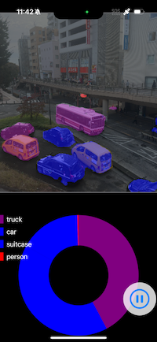

# CoreML Semantic Segmentation with DETR ResNet50

This project is a practice implementation using Apple's DETR ResNet50 Semantic Segmentation model. It performs segmentation on live camera input in an iOS app, and displays the results along with a pie chart showing the area fraction of each detected class.

## Features
- Real-time segmentation using DETR ResNet50 Semantic Segmentation model
- Visualization of segmentation results overlaid on the camera feed
- Pie chart display of class area fractions




## Setup Instructions

1. **Clone the Repository**
   ```bash
   git clone https://github.com/DaisukeNakajima001/Test_CoreML_Segmentation_and_Drow_AreaFraction_Graph.git
   ```

2. **Download the Model**
   - Go to [Apple's Machine Learning Models](https://developer.apple.com/machine-learning/models/).
   - Download the **DETR ResNet50 Semantic Segmentation** model.

3. **Add the Model to the Project**
   - Place the downloaded `.mlmodel` file in the AI_Models directory of the project.
   - In Xcode, drag and drop the `.mlmodel` file into the project navigator.
   - Ensure the model is added to the target.

4. **Build and Run the Project**
   - Open the project in Xcode.
   - Connect an iOS device and select it as the build target.
   - Press `Cmd+R` to build and run the app on your device.

## Notes
- The `.mlmodel` file is ignored in version control (`.gitignore`).
- You must download the model separately and link it in Xcode.
- Ensure proper permissions for camera access in your app's `Info.plist`.

```xml
<key>NSCameraUsageDescription</key>
<string>Camera access is required for segmentation.</string>
```
